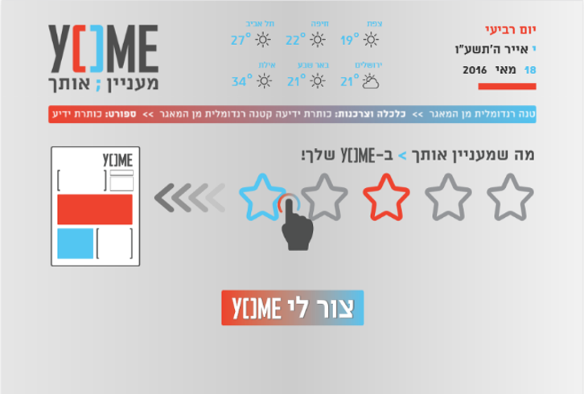
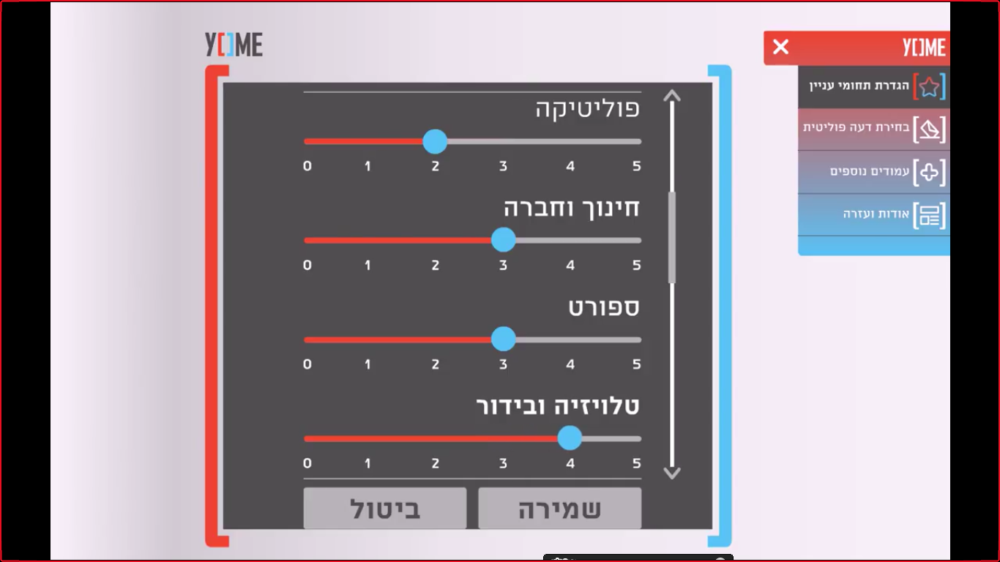
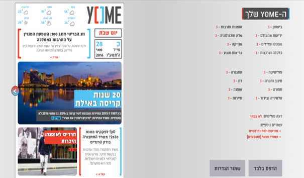
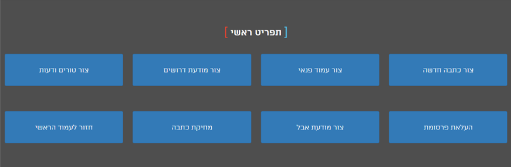
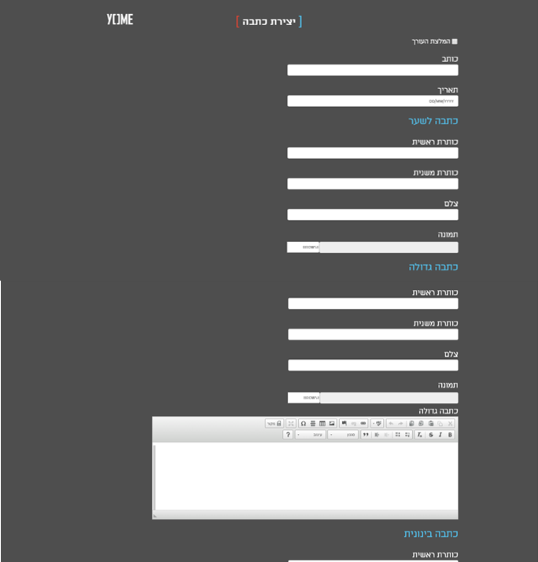
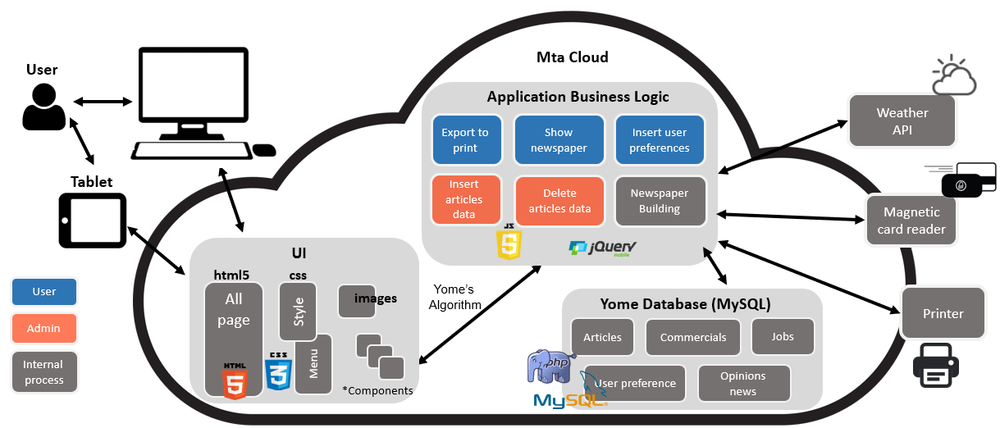

# Yome - Daily customized newspaper

Yome is a platform for creating a daily customized newspaper.

Nowadays, you need to search for the content that interests you in a sea of articles.
Yome offers you filtered content according to your ranking.
You can choose your ranking once and sign in again with your ID number, and Yome would show you new articles with your rank.

Yome was created as a final workshop for my degree with collaboration.
Students could also sign in by swiping their student card in a card reader that we added.

The content was added by an author, and we created a CMS for the convenience.

# Entry Page

# Ranking

# Newspaper Example

# CMS Example - Admin Menu

# CMS Example - Add a new article

# Architecture

